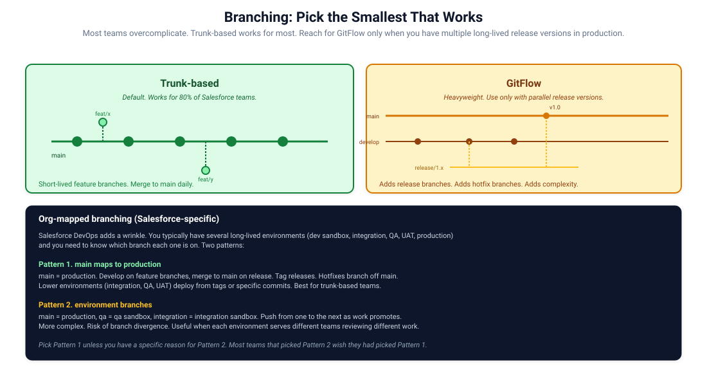

# 04. Branching Strategies

The branching question for Salesforce projects is the same as for any software project, with one wrinkle: most Salesforce orgs are long-lived, and your branches usually map to those orgs in some fashion.

Pick the simplest strategy that fits. Most teams overcomplicate.

## Trunk-based

One long-lived branch, `main`. Feature branches are short. Merge to main daily or sooner. Releases are tagged commits on main.

When this fits:

- Most internal Salesforce teams.
- Single production org or a small number of synchronised orgs.
- CI is fast enough that integration is cheap.

What you give up:

- Parallel release versions in production. If `v1.0` is in production and you start working on `v2.0`, both being in flight is awkward.

What you gain:

- Simplicity. No release branches, no hotfix branches, no merge-back rituals.
- Continuous integration in the literal sense. Branches don't diverge.
- Less ceremony.

## GitFlow

Long-lived `develop` and `main`. Releases branch off `develop`, get tested, merge to `main` when ready, get tagged. Hotfixes branch off `main`, merge back to both. Feature branches off `develop`.

When this fits:

- Multiple parallel release versions in production.
- ISVs supporting several customer versions simultaneously.
- Highly regulated industries that require formal release branches.

When it doesn't:

- Internal teams with one production target.
- Teams that haven't trained on the model. People will get the merge-back wrong.

The honest take: most teams do not need GitFlow. They adopt it because someone read about it and it sounded thorough. The complexity is a tax on every PR.

## Org-mapped branching (Salesforce-specific patterns)

Salesforce DevOps adds the question of how branches map to environments.

### Pattern 1. main maps to production, tags drive lower environments

`main` is what is in production. Lower environments (integration, QA, UAT) deploy from specific commits or tags. Hotfixes branch off `main` and are tagged for deployment.

Best for trunk-based teams. Simple, clean, easy to reason about. The lower environments are described by "what tag is currently installed" rather than "what branch is this".

### Pattern 2. environment branches

`main` = production. `qa` = QA sandbox. `integration` = integration sandbox. Work flows by promoting between branches: feature merges to `integration`, then promotes to `qa`, then to `main`.

Sounds tidy. In practice it produces:

- Branch divergence over time.
- Painful rebases as the same change has to be promoted across branches.
- Confusion about which branch is canonical for what.

Most teams that picked this pattern wish they had picked Pattern 1.

### Pattern 3. release branches

A variant for ISVs. Each release line gets its own branch (`release/1.x`, `release/2.x`). Each branch gets package versions cut from it. Production installs versions from the branch corresponding to the customer's current version.

Necessary for multi-version ISV products. Overkill for internal teams.

## Practical recommendations

- **Default to trunk-based with Pattern 1.** Simple, scales to most internal teams.
- **Reach for GitFlow only with parallel release versions.** Otherwise you are paying tax for nothing.
- **Avoid environment branches.** They cause more problems than they solve.
- **Tag every production deploy.** A tag points at the exact commit that is running. Easy rollback target.

## Branch naming

Conventions that hold up:

- `feature/<ticket>-<short-name>`: e.g. `feature/SF-123-order-status-action`.
- `hotfix/<ticket>-<short-name>`: e.g. `hotfix/SF-457-broken-flow`.
- `release/<version>`: e.g. `release/2.0.0` (only with GitFlow).

Tickets in the branch name make traceability easy. The short name keeps it human-readable.

## Pull requests

A few rules that pay off:

- **Block merge on red CI.** No exceptions.
- **Require at least one reviewer.** Two for high-risk areas.
- **Squash on merge.** Keeps `main` history linear and clean.
- **Delete branches after merge.** Otherwise they accumulate.
- **Use draft PRs for in-progress work.** Lets reviewers see direction without committing to review.

## Branch protection rules

Configure these in GitHub or GitLab:

- `main` cannot be pushed to directly; PR required.
- PRs must pass status checks before merge.
- PRs must have at least one approval.
- Force pushes prohibited.
- Branch deletion prohibited.

For production-mapped branches, add:

- Required status check: production-equivalent test pass.
- Linear history requirement (squash or rebase).

## What if multiple developers touch the same .agent or large XML file

This is the practical pain point that drives some teams to environment branches. The .agent DSL files, profiles, custom object metadata, and large flow XML files all merge poorly.

Better mitigations than environment branches:

1. **Smaller, focused commits.** Don't let one PR touch a profile and add ten new flows.
2. **Owner conventions.** One developer owns a particular agent's `.agent` file at a time. Coordinate.
3. **Source-format splits.** As discussed in Chapter 3, breaking large objects into per-component files reduces conflicts.
4. **`.forceignore` profiles.** If profiles are causing constant conflicts, exclude them and manage permission sets instead. See Chapter 5.

## Dealing with long-running feature work

Sometimes a feature legitimately takes weeks. A few options:

- **Feature flags.** Ship the code with a custom metadata flag that's off in production. Turn it on when ready.
- **Long-lived feature branch with regular rebases.** Keep merging from `main` weekly. Rebase or merge.
- **Feature module as a separate package directory.** Develop in isolation, deploy as a unit when ready.

Avoid the option of "just don't merge for a month". The branch becomes radioactive. Nobody wants to merge it. It dies.

## What to do when you inherit a chaotic branching strategy

A common situation. Old project, inherited, branching is a mess.

The path back to sanity:

1. Identify what is actually in production. Look at the deployed metadata; do not trust git tags.
2. Pick a commit in the repo that matches. If none does, create a new branch from main and reconcile.
3. Document the agreement. "main is what is in production. We tag releases. We work in feature branches."
4. Enforce branch protection.
5. Delete the noise. Merge open PRs or close them. Delete stale branches.
6. Communicate the change clearly to the team.

The migration takes a sprint. The peace afterwards lasts years.

## References

- [Salesforce DX branching guidance](https://developer.salesforce.com/docs/atlas.en-us.sfdx_dev.meta/sfdx_dev/sfdx_dev_modular_dev_model.htm)
- [Trunk-Based Development](https://trunkbaseddevelopment.com/)
- [Atlassian: Git workflows](https://www.atlassian.com/git/tutorials/comparing-workflows)
- [GitHub branch protection rules](https://docs.github.com/en/repositories/configuring-branches-and-merges-in-your-repository/managing-protected-branches)
