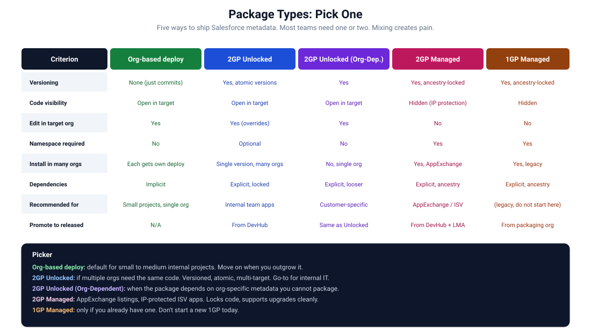

# 13. Packaging Overview

Five ways to ship Salesforce metadata. Picking the right one is the second most important decision in your DevOps engagement. Picking wrong locks you in for years.



## The five options

### 1. Org-based deploys (no package)

Source flows through environments via metadata API deploys. No package management. Each deploy is an incremental change applied to the target org.

**When this fits**: small to medium internal projects, single org chain, codebase under ~50 MB.

**When it stops fitting**: deploys hit timeout, multiple orgs need the same code, you need to track exactly what version is where.

### 2. 2GP Unlocked Packages

Source becomes a package. Each package version is built once, immutable, atomic. Versions install into target orgs. The org receives a self-contained, identified, versioned chunk of metadata.

Open source code (visible in target). Editable in target (target can override package metadata). No mandatory namespace.

**When this fits**: internal team apps deployed to multiple orgs, codebases that benefit from atomic versioning.

**When it stops fitting**: you need IP protection (don't use Unlocked), you need installs in customer orgs (consider Managed instead).

### 3. 2GP Unlocked Packages (Org-Dependent)

A variant of Unlocked where the package allows references to metadata that's expected to exist in the target org but is not part of the package. Useful when a package depends on, say, a custom object that varies per customer.

**When this fits**: customer-specific deployments with shared logic, internal apps that depend on org-specific schemas.

**When it doesn't**: most other cases. Org-dependent unlocked has more rough edges than regular unlocked.

### 4. 2GP Managed Packages

The Managed equivalent. Code is hidden in the target org (IP protection). Cannot be edited in target. Requires a namespace. Designed for ISVs publishing on the AppExchange, with customer support, upgrades, deprecation, etc.

**When this fits**: AppExchange listings, ISV products, anything where you sell or distribute Salesforce code as a product.

**When it doesn't**: internal projects. Managed adds substantial overhead.

### 5. 1GP Managed Packages (legacy)

The original packaging system. Older, more limited, painful to migrate from. Salesforce considers it legacy.

**When this fits**: you already have a 1GP managed package. Migration to 2GP managed is now possible.

**When it doesn't**: starting a new project. Always start with 2GP.

## Decision flow

```
Do you need to install in multiple orgs?
├─ No -> Org-based deploys. Stop here.
└─ Yes
   │
   ├─ Are you publishing on the AppExchange?
   │  └─ Yes -> 2GP Managed.
   │
   ├─ Do you need IP protection (hidden code)?
   │  └─ Yes -> 2GP Managed.
   │
   ├─ Does each customer org have unique metadata the package depends on?
   │  └─ Yes -> 2GP Unlocked (Org-Dependent).
   │
   └─ Otherwise -> 2GP Unlocked.
```

Most teams end up at "Org-based deploys" or "2GP Unlocked". The other branches are smaller populations.

## Cost-benefit summary

### Org-based deploys

**Benefits**: simple, no learning curve, fast feedback for small projects.

**Costs**: source drift, deploy times grow, no version tracking, hard to roll back.

### 2GP Unlocked

**Benefits**: versioned, atomic, multi-target, dependency tracking, easier rollback, parallel work on independent packages.

**Costs**: learning curve, infrastructure (Dev Hub, package aliases), version management overhead, slower iteration.

### 2GP Managed

**Benefits**: IP protection, AppExchange-ready, customer-managed upgrades, formal versioning.

**Costs**: namespace lock-in (forever), code visibility limits, ancestry constraints, certification requirements for AppExchange.

## When to switch from one to another

### Org-based to 2GP Unlocked

Symptoms that you've outgrown org-based:

- Deploys take more than 30 minutes routinely.
- You have multiple production orgs you want to keep in sync.
- You need to know "what version is in this org" and currently can't answer.
- Different parts of the codebase want to release on different cadences.

The migration is a real project. Plan it as a quarter, not a sprint. Start by introducing package directories in `sfdx-project.json` without yet creating packages. Get the structure right. Then promote each directory to a package one at a time.

### 2GP Unlocked to 2GP Managed

Triggers:

- AppExchange ambitions.
- Need to hide source from customers.
- Multi-tenant SaaS distribution model.

The migration is also real. Managed adds constraints on `public` versus `global`, requires a namespace, locks ancestry. Salesforce documents conversion paths but they are not lossless.

### 1GP Managed to 2GP Managed

Salesforce supports the migration. It is a documented multi-step process. Start by reading [Salesforce's 1GP-to-2GP guide](https://developer.salesforce.com/docs/atlas.en-us.pkg2_dev.meta/pkg2_dev/sfdx_dev2gp_migrate_existing.htm) end-to-end before doing anything.

## What a "package" actually is

A 2GP package is:

- A definition in `sfdx-project.json` (one entry under `packageDirectories`, plus aliases).
- A `Package2` record in your Dev Hub.
- A series of immutable `Package2Version` records, each tied to a specific source state.

When you "install a package", you install a specific `Package2Version` into a target org. The target org now has a record that says "this version is installed".

When you "promote a package version to released", the version becomes immutable and installable in production-like orgs. Beta versions can only install in non-production scratches and sandboxes.

## Package vs package directory vs package version

Three things often confused:

- **Package directory**: a folder in your source (`force-app`, or several others). Defined in `sfdx-project.json`.
- **Package**: a logical container in the Dev Hub. Has a `Package2` record. Maps to a package directory (typically one-to-one).
- **Package version**: an immutable build of the package. Has a `Package2Version` record. Tied to a specific source state.

A typical project has a few package directories, each mapped to a package, each with many versions over time.

## When in doubt

**Default to org-based deploys** unless you have a clear reason for packaging. The complexity of packages should be a deliberate choice, not a default.

**Default to 2GP Unlocked** when you need packaging without IP concerns.

**Reach for 2GP Managed** only for ISV products or true IP protection needs.

**Avoid 1GP Managed** for new projects.

## What this chapter does not cover

- The mechanics of building 2GP Unlocked packages: [Chapter 14](./14-2gp-unlocked.md).
- 2GP Managed specifics: [Chapter 15](./15-2gp-managed.md).
- Dependencies and ancestry: [Chapter 16](./16-dependencies-and-ancestry.md).
- Version numbering strategy: [Chapter 17](./17-versioning.md).

## References

- [2GP overview](https://developer.salesforce.com/docs/atlas.en-us.pkg2_dev.meta/pkg2_dev/sfdx_dev2gp.htm)
- [Choose a Package Type](https://developer.salesforce.com/docs/atlas.en-us.pkg2_dev.meta/pkg2_dev/sfdx_dev2gp_introduction.htm)
- [Unlocked Packages](https://developer.salesforce.com/docs/atlas.en-us.pkg2_dev.meta/pkg2_dev/sfdx_dev2gp_create_unlocked_pkg.htm)
- [Managed Packages](https://developer.salesforce.com/docs/atlas.en-us.pkg2_dev.meta/pkg2_dev/sfdx_dev2gp_create_managed_pkg.htm)
- [1GP to 2GP migration](https://developer.salesforce.com/docs/atlas.en-us.pkg2_dev.meta/pkg2_dev/sfdx_dev2gp_migrate_existing.htm)
