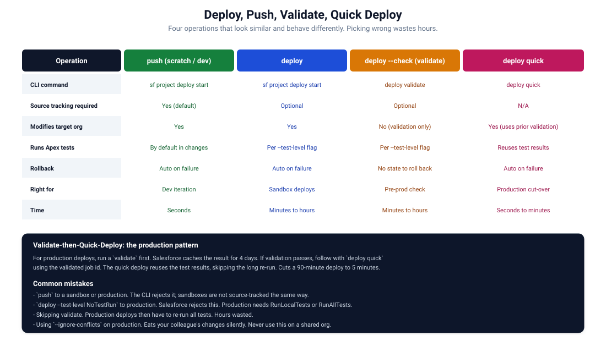

# 18. Deploy Semantics

Four operations that look interchangeable. Aren't.



## The four operations

| Operation | When to use |
|-----------|-------------|
| `push` (implicit in `deploy start` for source-tracked orgs) | Scratch orgs, source-tracked sandboxes |
| `deploy` | Sandboxes, production, anything not source-tracked |
| `validate` (deploy --check or deploy validate) | Pre-flight before a production deploy |
| `quick deploy` | Promote a validated job in seconds |

The CLI commands have unified under `sf project deploy start` for most operations, with flags or sub-commands for the variants.

## push

Used against source-tracked orgs. Deploys only what changed since last sync. Updates source tracking state on success.

```bash
sf project deploy start --target-org dev
```

In a scratch org, this is implicitly a `push`. The CLI compares your local source to the org's tracking state and ships only the differences.

Pros: fast for incremental changes. Conflict detection. Source tracking stays accurate.

Cons: only works on source-tracked orgs. Cannot specify a manifest.

## deploy (full deploy)

Against any org. Deploys what you tell it to deploy.

```bash
# By directory
sf project deploy start --source-dir force-app --target-org sandbox

# By manifest
sf project deploy start --manifest manifest/package.xml --target-org sandbox
```

Pros: explicit. Works against any org. Repeatable.

Cons: ships everything you specify, even if unchanged. Slower for incremental updates.

For sandboxes and production, `deploy` is what you want.

## validate (deploy --check or deploy validate)

A dry-run. Goes through the entire deploy process: parses metadata, runs tests, checks for errors. Does not actually modify the target org. Returns a job id.

```bash
sf project deploy validate \
    --manifest manifest/package.xml \
    --target-org production \
    --test-level RunLocalTests
```

The validation result is cached in Salesforce for 4 days. If you validate today and want to deploy tomorrow, use the cached result.

Pros: catches errors before touching production. No risk to the target.

Cons: takes the same time as a real deploy. Tests run.

For production, always validate first.

## quick deploy

Promotes a previously validated job to a real deploy. The job's tests have already run and passed; the quick deploy skips them.

```bash
# Get the job id from a recent validation
JOB_ID=$(sf project deploy report --use-most-recent --json | jq -r '.result.id')

sf project deploy quick \
    --job-id "$JOB_ID" \
    --target-org production \
    --wait 30
```

Or use the most recent validated job:

```bash
sf project deploy quick \
    --use-most-recent \
    --target-org production
```

Pros: fast. A 90-minute production deploy becomes a 5-minute quick deploy.

Cons: only works for jobs validated in the last 4 days. Cannot quick-deploy a job whose tests didn't pass.

## The validate-then-quick pattern

For production:

```bash
# Step 1. Validate (slow, runs tests)
sf project deploy validate \
    --manifest manifest/package.xml \
    --target-org production \
    --test-level RunLocalTests \
    --wait 60

# Step 2. Approval gate (human review)
# ... someone signs off ...

# Step 3. Quick deploy (seconds, no tests re-run)
sf project deploy quick --use-most-recent --target-org production
```

This is the pattern most production deploys should follow. The validate step catches problems and runs tests. The quick deploy promotes the verified state with minimal additional time.

## Test levels

Every deploy has a `--test-level`:

| Level | Behavior |
|-------|---------|
| `NoTestRun` | No tests. Default for sandboxes. Rejected for production. |
| `RunSpecifiedTests` | Run only the named test classes. Use `--tests Class1 Class2`. |
| `RunLocalTests` | Run all tests in the org's namespace. Most common for production. |
| `RunAllTestsInOrg` | Run every test, including managed packages. Slow, rare. |

Production accepts only `RunLocalTests`, `RunAllTestsInOrg`, or `RunSpecifiedTests` (with valid coverage).

See [Chapter 19](./19-test-levels.md).

## Common deploy flags

```bash
sf project deploy start \
    --manifest manifest/package.xml \
    --target-org sandbox \
    --test-level RunLocalTests \
    --wait 60 \
    --concurrency-mode Parallel \
    --ignore-warnings \
    --verbose
```

- `--wait <minutes>`: how long to wait for the deploy to finish. Default low. Set higher for big deploys.
- `--concurrency-mode`: `Parallel` (default) or `Serial`. Use Serial when racing tests cause flakes.
- `--ignore-warnings`: continues if warnings (not errors) appear. Use with care.
- `--verbose`: more detailed output. Useful when debugging.

Avoid:

- `--ignore-conflicts` against shared orgs. Eats colleagues' changes silently.
- `--ignore-errors` (where supported). You're hiding problems.

## Deploy from a Git diff

For incremental deploys in CI:

```bash
sfdx sgd:source:delta \
    --to HEAD \
    --from origin/main \
    --output manifest \
    --generate-delta

sf project deploy start \
    --manifest manifest/package.xml \
    --post-destructive-changes manifest/destructiveChangesPost.xml \
    --target-org integration \
    --test-level RunLocalTests
```

Only the components that changed are deployed. Faster than full deploys.

## Reporting on deploy state

```bash
# Recent deploy details
sf project deploy report --use-most-recent --target-org production

# Status of a specific job
sf project deploy report --job-id 0Af... --target-org production

# Cancel a running deploy (rare, but possible)
sf project deploy cancel --use-most-recent --target-org production
```

The `--json` flag is useful for piping to jq or saving artifacts.

## Common gotchas

### "DEPLOY_FAILED: missing dependency"

A component being deployed references something not yet in the target org and not in the deploy.

Fix: include the dependency in the deploy, or deploy in stages with the dependency first.

### "Test failures"

The deploy ran tests; some failed. Salesforce rolls back the entire deploy.

Fix: fix the test (preferably) or temporarily exclude it (rarely the right answer).

### "Validation took 45 minutes"

Big deploys with full test suites are slow. The validate step is the slow one. The quick deploy that follows is fast.

Mitigations:

- Use `--test-level RunSpecifiedTests` for incremental deploys where you know which tests cover the change.
- Speed up the test suite (asyncs, mocks, smaller fixtures).
- Use 2GP packaging so each package version is built once.

### "Quick deploy: validation expired"

Validation results are cached for 4 days. If you validated last week, you can't quick-deploy this week. Re-validate.

### "Mixed metadata error"

Some metadata types (User, Permission Set Assignment) cannot be deployed in the same transaction as others.

Fix: split the deploy into two passes, or use `runOnce` settings to defer one part.

### "Deploy stuck"

Deploys can hang in `Pending`. Usually resolves in a few minutes. If it hangs over 30 minutes, cancel and re-deploy.

```bash
sf project deploy cancel --use-most-recent --target-org production
```

## Deploy result codes

The CLI exit codes:

- `0`: success.
- non-zero: failure (specific code depends on the error).

Use exit codes in CI to fail builds on deploy errors.

## A reference deploy script for production

```bash
#!/bin/bash
set -euo pipefail

ORG="${1:-production}"

# Validate
echo "Starting validation..."
JOB_ID=$(sf project deploy validate \
    --manifest manifest/package.xml \
    --target-org "$ORG" \
    --test-level RunLocalTests \
    --wait 90 \
    --json | jq -r '.result.id')

echo "Validation passed. Job id: $JOB_ID"

# Approval gate (in real life, a human or an explicit promote step)
read -p "Approve quick deploy to $ORG? (y/n): " -r
[[ "$REPLY" =~ ^[Yy]$ ]] || { echo "Aborted."; exit 1; }

# Quick deploy
echo "Quick deploying..."
sf project deploy quick \
    --job-id "$JOB_ID" \
    --target-org "$ORG" \
    --wait 30

echo "Done."
```

Adapt for your CI system. Replace the `read` with an automated approval gate or a manual run trigger.

## References

- [`sf project deploy` commands](https://developer.salesforce.com/docs/atlas.en-us.sfdx_cli_reference.meta/sfdx_cli_reference/cli_reference_project_commands_unified.htm)
- [Deploy a Validated Component Set as a Quick Deploy](https://developer.salesforce.com/docs/atlas.en-us.api_meta.meta/api_meta/meta_deploy_quick.htm)
- [Apex test levels](https://developer.salesforce.com/docs/atlas.en-us.api_meta.meta/api_meta/meta_deploy.htm)
- [Mixed-DML errors](https://developer.salesforce.com/docs/atlas.en-us.apexcode.meta/apexcode/apex_dml_setupobjects.htm)
