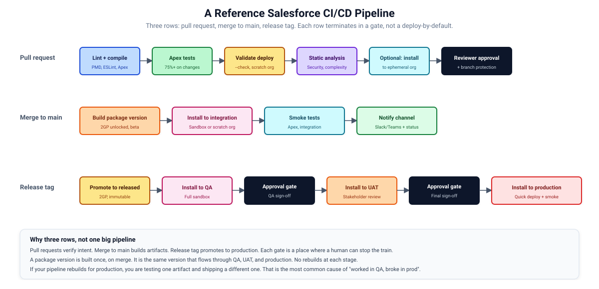

# 21. CI/CD Architecture

The reference shape of a Salesforce CI/CD pipeline. Concrete examples for the most common providers in [Chapter 22](./22-secrets-and-auth.md) (auth) and the templates folder. This chapter is the architecture.



## Three rows, three triggers

A working Salesforce pipeline has three distinct flows:

1. **Pull request.** Verifies the change is sound. Does not deploy anywhere durable.
2. **Merge to main.** Builds artifacts. Deploys to integration. Notifies the team.
3. **Release tag.** Promotes through QA, UAT, production. Human gates between stages.

Each row has a different trigger, different scope, different risk profile. Conflating them produces fragile pipelines.

## The pull request row

What it does:

- Static analysis: PMD, ESLint, Apex linter.
- Apex compile and test in a scratch org.
- Validate a deploy against a designated org (without applying).
- JSON Schema validation for any structured content.
- Security scanning (Salesforce Code Analyzer).
- Code review approval (human gate).

What it does NOT do:

- Deploy to anything durable.
- Build a package version (unless you're testing the build itself).

Speed matters here. PR runs gate every commit. Slow PR runs slow the team.

Target: under 10 minutes from PR opened to checks complete.

## The merge-to-main row

What it does:

- Build a package version (for 2GP projects).
- Deploy to integration sandbox or scratch org.
- Run smoke tests.
- Notify the team channel.
- Tag the build.

What it does NOT do:

- Deploy to QA, UAT, or production. That's the next row.

Builds happen here exactly once per merge. The artifact (package version, tagged commit) is what flows through later environments.

Target: fast enough that integration is current. 15-30 minutes is fine.

## The release-tag row

What it does:

- Deploy to QA. Smoke test.
- Human gate.
- Deploy to UAT. Stakeholder validation.
- Human gate.
- Deploy to production. Quick-deploy from a validated job.
- Notify, tag, audit.

What it does NOT do:

- Build new artifacts. The artifact was built on merge.
- Bypass human gates. Production decisions involve humans.

Speed is less important. Reliability is everything.

Target: production deploy completes within an agreed release window (often hours, sometimes overnight).

## Build once, deploy many

The most important architectural rule: the artifact built on merge is the same artifact that ships to production.

For 2GP packages: the package version `1.2.0-3` built on merge is what installs in QA, UAT, and prod. Same `04t...` id. Same metadata.

For org-based deploys: the validated deploy job from QA can quick-deploy to UAT and to production using the same source.

If your pipeline rebuilds at each stage, you're testing one artifact and shipping a different one. That's a class of bug that's hard to debug.

## Approval gates

Each promotion has a human (or a documented automated rule). Concretely:

- **PR -> merge:** at least one reviewer.
- **Integration -> QA:** automatic on merge, no human gate (low risk).
- **QA -> UAT:** human gate. QA team signs off.
- **UAT -> production:** human gate. Stakeholders sign off, plus a deploy approver.

Gates can be:

- Manual buttons in CI (GitHub Actions environments, GitLab manual jobs, Bitbucket manual triggers).
- ChatOps approvals in Slack/Teams.
- Tickets in Jira/Asana that have to be marked Done.

Whatever fits your team. The gate's job is to be a moment where someone consciously decides to proceed.

## The artifact

In a 2GP project, the artifact is:

- Package version id (`04t...`).
- Salesforce-side: a `Package2Version` record.
- Repo-side: a Git tag plus an updated `packageAliases` entry.

In an org-based project, the artifact is:

- A specific commit sha.
- Optionally, a validated deploy job id (cached for 4 days).

Both should be tracked. A deploy run records:

- Source commit.
- Destination org.
- Test results.
- Deployer.
- Timestamp.

This is your audit trail. Don't skip it.

## Per-environment configuration

Some things vary between environments. Common:

- Authentication credentials (different per org).
- Named credential URLs.
- Custom metadata values (feature flags, environment-specific settings).
- Per-environment user assignments.

Patterns:

- **Per-env deployment scripts.** Each env has a script that knows its specifics.
- **Variable substitution.** A template with placeholders, replaced at deploy time.
- **Custom metadata records.** A `Environment_Config__mdt` with values for each env.

Pick one. Stick with it. Mixing creates confusion.

## Failure handling

When a step fails, the pipeline should:

1. Stop immediately. No subsequent steps run.
2. Notify the relevant channel.
3. Annotate the failure with the actual error (not a generic "build failed").
4. Preserve logs and artifacts for triage.

Common failure types:

- Compile errors. Usually a developer's PR. Reject.
- Test failures. Same.
- Validation errors. Salesforce rejected the deploy. Look at the error.
- Auth failures. CI lost connection to the org. Retry once, then escalate.
- Dependency missing. A required package is not installed in the target. Install or fix the dependency declaration.

## Fault tolerance and retries

Some steps are flaky. Don't bake flakiness into the pipeline; address the root cause. But for occasional transient failures:

- Auth: retry once with refreshed credentials.
- Network: retry up to three times with exponential backoff.
- Apex tests with timing flakes: do not retry. Fix the test.

`Validate` jobs should not be retried automatically. If validation fails, that means something is wrong. Investigate.

## Pipeline visibility

The team should be able to answer:

- What's currently being built?
- What was the last successful deploy to each env?
- What's the queue of pending production deploys?
- Who approved the last production deploy?

A status page or chat-bot answers these. Treat the pipeline as observable infrastructure, not a black box.

## Test feedback

Tests run in CI. Their failures need to land where developers see them quickly:

- JUnit XML output rendered as failure summaries in the PR.
- Test-result links posted to the team channel.
- Coverage trends visible per PR (rising or falling).

PRs that lower coverage should be flagged automatically.

## Caching and speed

CI run time adds up. A 30-minute PR run, 50 PRs a week, equals 25 hours of waiting per week per developer.

Mitigations:

- Cache `node_modules` for LWC builds.
- Cache the Salesforce CLI install across runs.
- Use snapshots for scratch orgs.
- Run quick checks (lint, schema validation) before slow checks (Apex compile).
- Parallelise test execution.

A 5-minute PR run is achievable for many projects. Don't accept 30 minutes as a fact of life.

## Consistency between dev and CI

Developers should be able to run the same commands locally that CI runs:

```bash
# CI runs:
sf project deploy start --target-org $TARGET --test-level RunLocalTests

# Developers run the same locally:
sf project deploy start --target-org dev --test-level RunLocalTests
```

If the local command works and CI fails, the divergence between dev and CI environments is the bug. Fix it (often: missing env variable, different scratch definition).

## Common architectural mistakes

### One giant pipeline file

A YAML with 500 lines that does everything. Hard to debug, hard to extend.

Split into per-job files. Use shared workflows or includes for reuse.

### Production deploys without approval gates

Auto-deploys to production are risky. They require enormous confidence in tests and metadata. Most teams aren't there.

Add a human gate. Even a single button click is enough friction to prevent disasters.

### Different commands per environment

The deploy script for QA differs from the one for production. Drift accumulates. Bugs ship.

Use the same script, parameterised by env name. Configuration differs; logic does not.

### CI as the only deployment mechanism

CI fails. The team has nothing else. Production is stuck.

Document a manual deploy path. Have a designated person who can run it from a clean shell. Practice it.

### CI without notifications

A failed nightly pipeline that nobody knew about. Someone discovers a week later. Several deploys missed.

Wire up notifications. Slack, email, whatever. Failed jobs scream.

## Reference architecture

For most Salesforce internal teams:

- **Source:** GitHub or GitLab.
- **CI:** GitHub Actions or GitLab CI.
- **Scratch org pool:** Dev Hub, with snapshot strategy.
- **Sandboxes:** integration (source-tracked), QA (full or partial), UAT (full).
- **Auth:** SFDX auth URL for non-prod, JWT for prod.
- **Notifications:** Slack channel for the project.
- **Dashboards:** GitHub/GitLab build status + a Salesforce health dashboard.

For ISV teams add:

- **Packaging Dev Hub.**
- **Packaging org for 1GP-style needs.**
- **License Management App.**
- **AppExchange listing tooling.**

## References

- [Salesforce CLI for CI](https://developer.salesforce.com/docs/atlas.en-us.sfdx_dev.meta/sfdx_dev/sfdx_dev_continuous_integration.htm)
- [Salesforce DevOps best practices](https://developer.salesforce.com/docs/atlas.en-us.sfdx_dev.meta/sfdx_dev/sfdx_dev_intro.htm)
- [GitHub Actions documentation](https://docs.github.com/en/actions)
- [GitLab CI documentation](https://docs.gitlab.com/ee/ci/)
- [Salesforce DevOps Center](https://help.salesforce.com/s/articleView?id=sf.devops_center_overview.htm)
