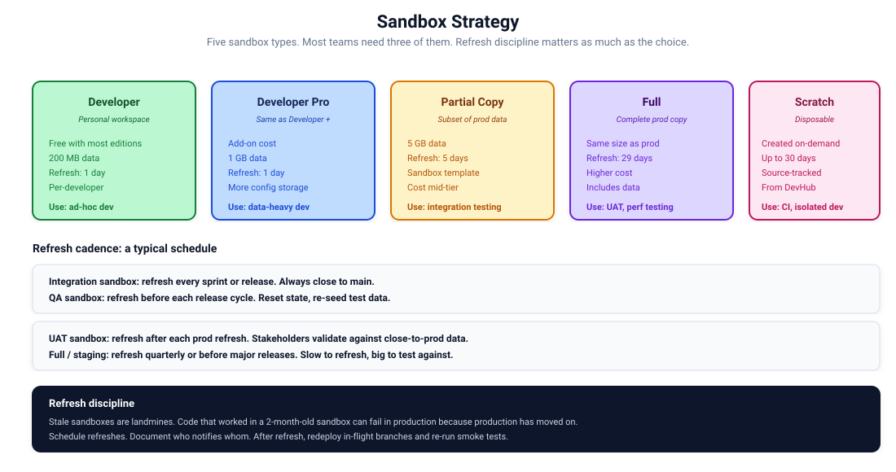

# 23. Sandbox Strategy

Five sandbox types. Most teams need three. Refresh discipline matters as much as the choice.



## The five types

### Developer

Smallest. Free with most editions. 200 MB data. Refresh daily. Per-developer.

Use: ad-hoc development, throwaway testing.

### Developer Pro

Like Developer but bigger. 1 GB data. Refresh daily. Add-on cost.

Use: development that needs more storage (data-heavy testing).

### Partial Copy

Refresh from production with a subset of data. 5 GB data. Refresh every 5 days. Sandbox templates control which records come over.

Use: integration testing, training environments.

### Full

Complete copy of production. Same size limit as production. Refresh every 29 days. Highest cost.

Use: UAT, performance testing, production-equivalent staging.

### Scratch

Disposable, source-tracked, defined by config. Up to 30 days. Created on demand from a Dev Hub.

Use: development, CI.

## Picking the right type

### Default for individual developers

Scratch orgs. Source-tracked, disposable, reproducible. Faster than waiting for a Developer sandbox refresh.

If the work needs production data shapes, Developer Pro or Partial Copy.

### For integration testing

Partial Copy with a sandbox template that brings the relevant data. Or a long-lived Developer sandbox refreshed each sprint.

### For QA

Partial Copy is usually enough. Full if QA needs production-volume data or production-equivalent flows.

### For UAT

Full sandbox. Stakeholders need stable URLs and realistic data.

### For performance testing

Full sandbox, in a Salesforce instance close to your production instance.

### For production-equivalent staging

Full sandbox. Optionally a "release sandbox" that's pre-release tier (`previewSandbox`).

## Sandbox templates

When refreshing a Partial Copy or Full sandbox, you can specify which objects come over and how much data.

```bash
# Create a sandbox via metadata API
sf org create sandbox \
    --name MyQASandbox \
    --license-type Partial \
    --target-org production \
    --definition-file config/sandbox-def.json
```

The definition file specifies which sandbox template to use:

```json
{
  "sandboxName": "MyQASandbox",
  "licenseType": "Partial",
  "templateId": "0GQ..."
}
```

Templates are managed in Setup, Sandboxes. Different templates for different purposes (QA, training, etc.).

## Refresh cadence

A common rhythm:

- **Integration sandbox:** every sprint or on demand.
- **QA sandbox:** before each release cycle.
- **UAT sandbox:** after each prod refresh, ahead of stakeholder review.
- **Full / staging:** quarterly or before major releases.

The cadence depends on how much production drifts. If production gets weekly changes, sandboxes need weekly refreshes. If production is stable, monthly is fine.

## Refresh discipline

When you refresh:

1. **Notify the team.** Anyone using the sandbox loses their work in progress.
2. **Backup any sandbox-only state.** Test data, test users, in-progress configurations.
3. **Trigger refresh from production.** Setup, Sandboxes, Refresh.
4. **Wait.** Full refreshes take hours. Plan around it.
5. **Reapply post-refresh setup.** Anonymise data if needed. Disable email deliverability. Adjust connected app keys.
6. **Redeploy in-flight branches.** Source-tracked sandboxes need source pushed back.
7. **Smoke test.** Confirm the sandbox is functional.

Skipping post-refresh setup is the most common cause of sandbox surprises. Document the steps.

## Post-refresh setup

Things to do every time you refresh a sandbox from production:

### Email deliverability

Set `Email Deliverability` to `System email only` to prevent test runs from emailing real users.

```bash
# Update via Apex (anonymous):
sf apex run --target-org sandbox --apex-code "
Org_Settings__c settings = Org_Settings__c.getInstance();
// ... or use Setup, Email, Deliverability
"
```

In practice, it's a one-click Setup change.

### Anonymise email addresses

Production user emails should not receive test mail. Mass-update users:

```apex
List<User> users = [SELECT Id, Email FROM User WHERE IsActive = true];
for (User u : users) {
    u.Email = u.Email.replace('@', '+sandbox@');
}
update users;
```

### Disable scheduled jobs

Production-scheduled jobs may be running in the sandbox after refresh. Pause or remove.

```apex
List<CronTrigger> jobs = [SELECT Id, CronJobDetail.Name FROM CronTrigger];
// Review and abort as needed
System.abortJob(jobId);
```

### Reapply named credentials

Named credentials may need re-authentication or different URLs in sandbox.

### Reapply connected app config

OAuth tokens for sandbox users may need rotation. Connected apps point at production; if they should point at sandbox, update.

### Permission set assignments

Some permission set assignments don't survive refresh cleanly. Reapply for the test users.

### Custom metadata

Metadata records survive refresh. Verify the sandbox has the values it should (some teams use sandbox-specific custom metadata for things like connection URLs).

## Sandbox templates for partial refresh

For Partial Copy sandboxes, the template controls what data comes over. A useful template:

- All records from `User` (anonymised post-refresh).
- A representative slice of `Account` (top 100 by activity).
- Related `Contact`, `Opportunity` records.
- Reference data (`PriceBook`, `Pricebook2Entry`, custom metadata).
- Custom configuration (`Org_Settings__c`).

Don't bring everything. Partial sandboxes are limited in size. Choose what you actually need for testing.

## A typical org topology

For a mid-sized internal team:

| Sandbox | Type | Purpose | Refresh |
|---------|------|---------|---------|
| `dev-<name>` | Developer or scratch | Per-developer dev | Daily / on demand |
| `integration` | Developer or Partial Copy | Continuous integration | Sprint-end |
| `qa` | Partial Copy | QA testing | Before each release |
| `uat` | Full | Stakeholder UAT | After prod refresh |
| `staging` | Full | Pre-release validation | Quarterly |
| `production` | (production) | Production | n/a |

For an ISV team, add:

- A packaging Dev Hub.
- Multiple "subscriber" sandboxes simulating customer environments.

## Sandbox limits

The free tier with most editions includes:

- One Developer Pro per org.
- 25 Developer per org.
- One Partial Copy.
- One Full (with the right edition).

Need more? Salesforce sells expansion. Most teams hit these limits and have to negotiate.

For scratch orgs, the limits are different (Dev Hub-managed). See [Chapter 6](./06-scratch-orgs-from-zero.md).

## Common sandbox mistakes

### Long-lived sandboxes treated as source of truth

A sandbox running for two years, with config changes that nobody captured in source. The sandbox is the only place the config exists. Refresh deletes it.

Fix: enforce retrieve-after-UI-change discipline. Treat sandboxes as deployment targets, not authoring environments.

### Sharing UAT across teams

Two teams using one UAT sandbox. They step on each other's tests. UAT sign-off becomes ambiguous.

Fix: each team has its own UAT, or coordinate via documented testing windows.

### Refreshing too rarely

A QA sandbox running for a year without refresh. Diverged from production. Tests pass that wouldn't in production.

Fix: schedule refreshes. Cadence based on rate of production change.

### Refreshing too often

A full sandbox refreshed weekly. Days lost re-doing setup. Stakeholders frustrated by lost UAT work.

Fix: align refresh cadence with stakeholder workflow. Some sandboxes need stability, not freshness.

### Skipping post-refresh setup

Everyone forgets at least once. Then someone's test run emails 1000 customers.

Fix: a checklist (or better, a script) that runs post-refresh.

### No audit trail

Who refreshed UAT? When? Nobody knows. The change request lost.

Fix: log every sandbox refresh in the team's deployment log.

## A sandbox refresh runbook template

```markdown
# Sandbox refresh: UAT

## Pre-refresh
- [ ] Notify team (Slack #salesforce 1 day in advance).
- [ ] Confirm no in-progress UAT sessions.
- [ ] Backup sandbox-specific state if any.

## Refresh
- [ ] Setup, Sandboxes, find UAT, click Refresh.
- [ ] Approve refresh (this triggers Salesforce backend; can take hours).
- [ ] Wait for completion email.

## Post-refresh
- [ ] Set Email Deliverability to System email only.
- [ ] Run anonymise-emails script.
- [ ] Verify scheduled jobs (abort production-scheduled jobs).
- [ ] Reapply test user permission set assignments.
- [ ] Reauthenticate Named Credentials.
- [ ] Smoke test: log in, run one critical UAT scenario.
- [ ] Notify team (Slack #salesforce, "UAT refreshed and ready").

## Document
- [ ] Log refresh in team deployment log: who, when, why.
```

Adapt for each sandbox.

## References

- [Sandbox types](https://help.salesforce.com/s/articleView?id=sf.data_sandbox_environments.htm)
- [Refresh sandboxes](https://help.salesforce.com/s/articleView?id=sf.data_sandbox_refresh.htm)
- [Sandbox templates](https://help.salesforce.com/s/articleView?id=sf.data_sandbox_create_template.htm)
- [Email deliverability](https://help.salesforce.com/s/articleView?id=sf.emailadmin_setup_deliverability.htm)
- [Source tracking in sandboxes](https://help.salesforce.com/s/articleView?id=sf.deploy_sandboxes_st.htm)
