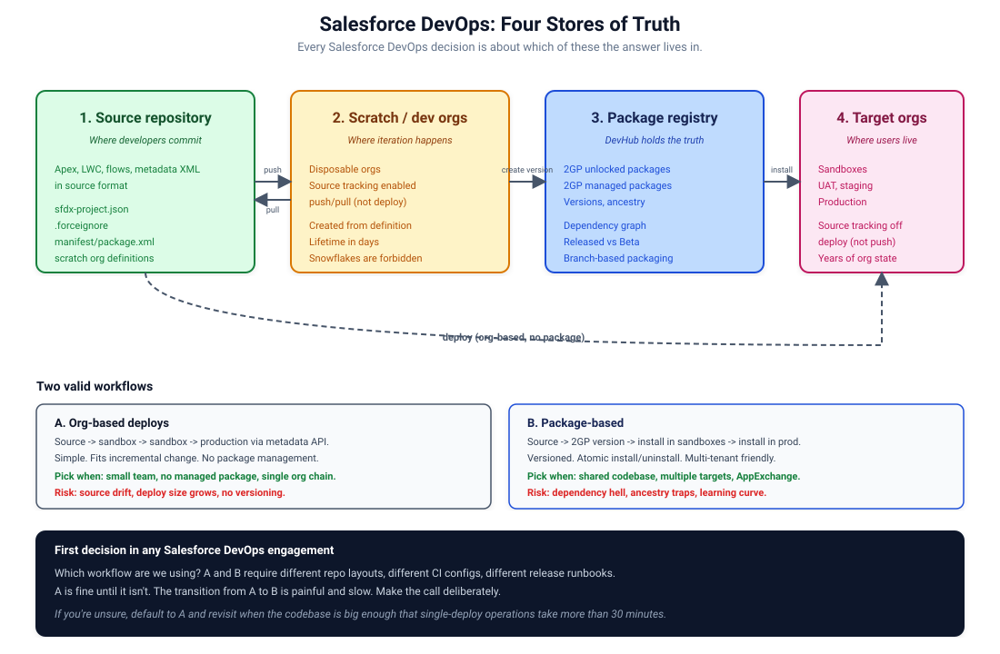

# Salesforce DevOps and Packaging Field Guide

A practical handbook for Salesforce architects, developers, and DevOps engineers who own how code gets from a developer's editor to a user's production org. Written by people who have shipped Salesforce code at scale and have the scars to prove it.

The aim of this guide is concrete: cut the time you spend reinventing release runbooks, pick the right packaging strategy on day one, and avoid the deploy disasters that everybody keeps running into because the docs are scattered across a dozen different Salesforce guides.

## Who this is for

- **Salesforce DevOps engineers** designing pipelines for one team or one hundred.
- **Architects** deciding between org-based deploys, 2GP unlocked packages, and 2GP managed packages.
- **Tech leads** setting up a new Salesforce project and choosing the conventions that will hold up two years from now.
- **Developers** who keep getting bitten by source tracking, mixed metadata, and "worked in QA, broke in production".

It assumes you know what an Apex class is, what a sandbox is, and what `sfdx-project.json` is for. It does not assume you know the difference between `deploy --check`, `deploy validate`, `deploy quick`, and `push`. By Chapter 18, you will.

## How to read it

Pick the chapter that matches what you are doing right now.

### Foundations

| Chapter | Read it when |
|---------|--------------|
| [00. Quickstart](./00-quickstart.md) | You want a working scratch org and a green deploy in 15 minutes. |
| [01. Mental Model](./01-mental-model.md) | You are starting on Salesforce DevOps and want the four-stores-of-truth picture in your head. |
| [02. Project Structure](./02-project-structure.md) | You are setting up `sfdx-project.json`, package directories, source layout. |
| [03. Source Format and Metadata Format](./03-source-and-metadata-format.md) | You see folders called `force-app/` versus `manifest/` and want to know what each one means. |

### Source control

| Chapter | Read it when |
|---------|--------------|
| [04. Branching Strategies](./04-branching.md) | You are picking a Git workflow for your Salesforce repo. |
| [05. .forceignore and Manifests](./05-forceignore-and-manifests.md) | Your deploys keep including files you don't want, or excluding files you do. |

### Scratch orgs (the dedicated section)

| Chapter | Read it when |
|---------|--------------|
| [06. Scratch Orgs From Zero](./06-scratch-orgs-from-zero.md) | You have never used a scratch org and need the foundational picture. |
| [07. Scratch Org Definitions](./07-scratch-org-definitions.md) | You are setting up the JSON config that controls what scratch orgs you get. |
| [08. Org Shapes](./08-org-shapes.md) | Your scratch orgs need to look like production. |
| [09. Source Tracking](./09-source-tracking.md) | You are confused about why `push` does one thing in scratch orgs and not in sandboxes. |
| [10. Scratch Org Snapshots](./10-scratch-org-snapshots.md) | Scratch creation is too slow. |
| [11. Scratch Orgs in CI](./11-scratch-orgs-in-ci.md) | You are wiring scratch orgs into a CI pipeline. |
| [12. Troubleshooting Scratch Orgs](./12-troubleshooting-scratch-orgs.md) | Something is wrong and you need a structured triage. |

### Packaging

| Chapter | Read it when |
|---------|--------------|
| [13. Packaging Overview](./13-packaging-overview.md) | You need to pick between org-based deploys and packages. |
| [14. 2GP Unlocked Packages](./14-2gp-unlocked.md) | You have decided on unlocked packages and need to actually build one. |
| [15. 2GP Managed Packages](./15-2gp-managed.md) | You are publishing to the AppExchange or building an ISV product. |
| [16. Dependencies and Ancestry](./16-dependencies-and-ancestry.md) | Your packages reference other packages, and you need to understand the lock-in. |
| [17. Versioning Strategy](./17-versioning.md) | You need to decide what your version numbers mean. |

### Deployment

| Chapter | Read it when |
|---------|--------------|
| [18. Deploy Semantics](./18-deploy-semantics.md) | You are mixing up `deploy`, `push`, `validate`, and `quick deploy`. |
| [19. Test Levels](./19-test-levels.md) | You want to know when to use `RunLocalTests` versus `RunSpecifiedTests`. |
| [20. Destructive Changes](./20-destructive-changes.md) | You need to delete metadata in a target org. |

### CI/CD and operations

| Chapter | Read it when |
|---------|--------------|
| [21. CI/CD Architecture](./21-cicd-architecture.md) | You are designing a pipeline for a Salesforce project. |
| [22. Secrets and Auth](./22-secrets-and-auth.md) | You are wiring up CI to authenticate to Salesforce. |
| [23. Sandbox Strategy](./23-sandbox-strategy.md) | You are deciding which sandbox types you need and how often to refresh. |
| [24. Rollback and Hotfixes](./24-rollback-and-hotfixes.md) | A release went wrong and you need a way back. |
| [25. AI-Assisted Development](./25-ai-assisted-development.md) | Your team uses Claude Code, Copilot, Codex, or Cursor with Salesforce. |

### Reference

| Chapter | Read it when |
|---------|--------------|
| [26. Troubleshooting](./26-troubleshooting.md) | Something deployed fine yesterday and breaks today. |
| [27. Anti-Patterns](./27-anti-patterns.md) | You want to know what to avoid before you do it. |
| [28. Glossary](./28-glossary.md) | You see a term and want one paragraph of context. |

### Worked material

| Folder | What's in it |
|--------|--------------|
| [Cookbook](./cookbook) | End-to-end worked examples. |
| [Templates](./templates) | Copy-paste skeletons for `sfdx-project.json`, scratch org definitions, CI configs, package manifests. |
| [Case Studies](./case-studies) | Anonymised real incidents and how they were resolved. |

## The thirty-second version

If you only have time for three rules:

1. **Build the package version once.** It travels through QA, UAT, and production unchanged. If your pipeline rebuilds at each stage, you are testing one artifact and shipping a different one.

2. **Validate before you deploy to production.** `sf project deploy validate` runs all the tests and saves the result for 4 days. `sf project deploy quick` then promotes that validated job in seconds. A 90-minute production deploy becomes a 5-minute quick deploy.

3. **Source is the truth.** What is in the org but not in source control will be lost. Adopt a retrieve-after-UI-change discipline. Treat the Setup UI as a place to author, not a place to store.

## The four stores of truth

Every DevOps decision in Salesforce is about which of these the answer lives in. Get clear on which is canonical for what, and most of the rest of the discipline falls out of it.

## Project status

This guide is at version 0.1.0. See [CHANGELOG.md](./CHANGELOG.md) for what's in this release.

Every chapter ends with a `## References` section linking to the canonical Salesforce documentation. The full source index is in [REFERENCES.md](./REFERENCES.md). Verification status and last-checked date are in [VERIFICATION.md](./VERIFICATION.md).

Contributions are welcome. See [CONTRIBUTING.md](./CONTRIBUTING.md) for the conventions and process. Be kind: see [CODE_OF_CONDUCT.md](./CODE_OF_CONDUCT.md).

## License

The text and diagrams are released under [Creative Commons Attribution 4.0](./LICENSE). Use this in your own work, including commercial work. Credit the source.

## A note on tone

The chapters here are direct. Sentences are short. There is no marketing language and no padding. When something is hard, the guide says it is hard. When a Salesforce feature has rough edges, the guide names them.

If you find an error or something out of date, fix it where you find it. The point of this guide is to keep the next person from losing a day to the same problem.
